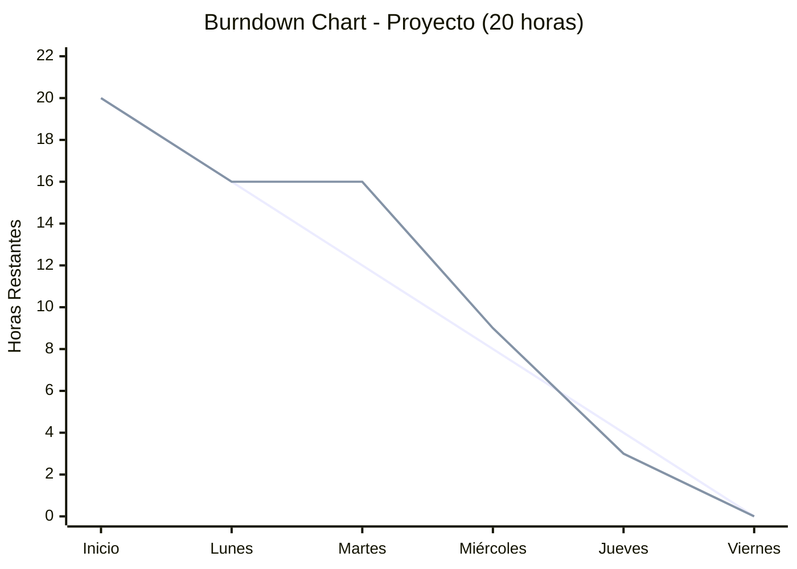

```mermaid
xychart-beta
    title "Burndown Chart - Proyecto (20 horas)"
    x-axis ["Inicio", "Lunes", "Martes", "Miércoles", "Jueves", "Viernes"]
    y-axis "Horas Restantes" 0 --> 22
    line "Ideal" [20, 16, 12, 8, 4, 0]
    line "Real" [20, 16, 16, 9, 3, 0]
```
